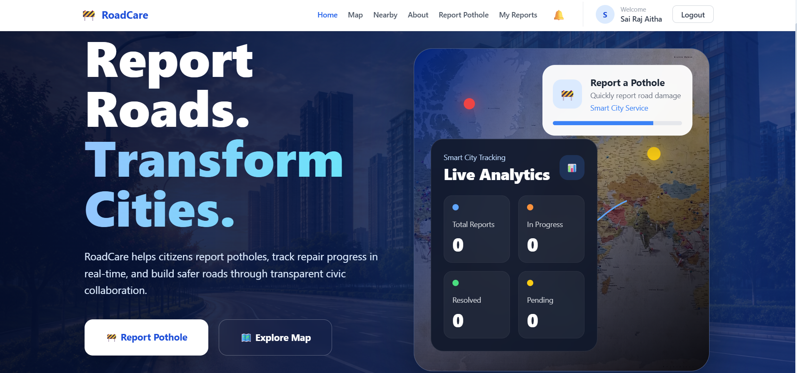
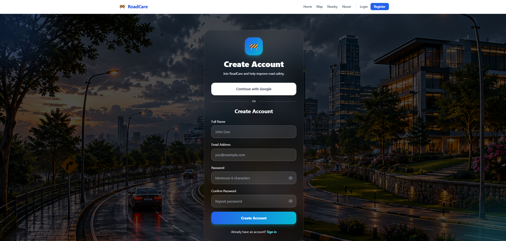
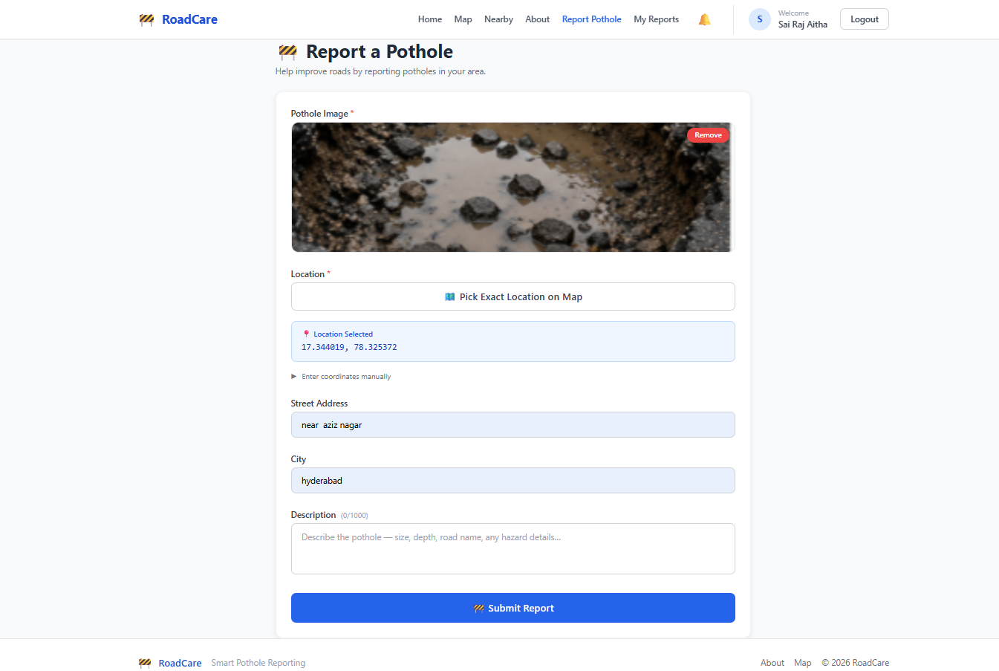
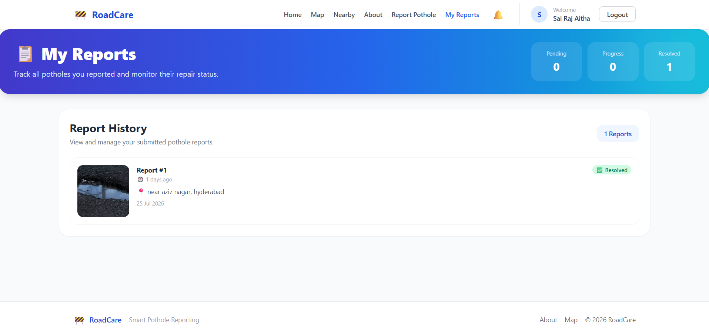
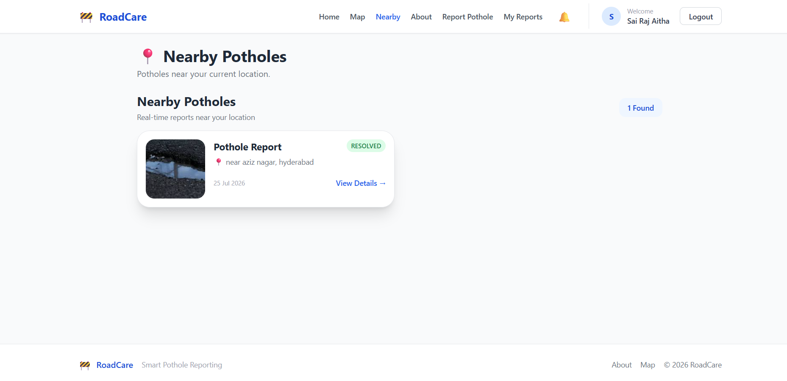
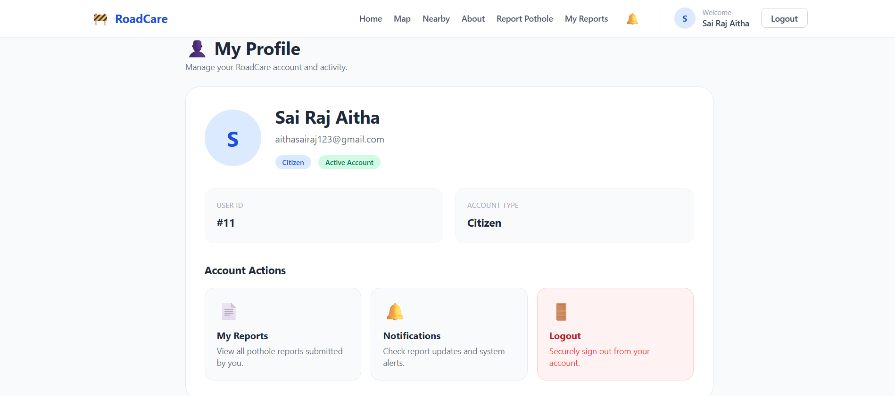
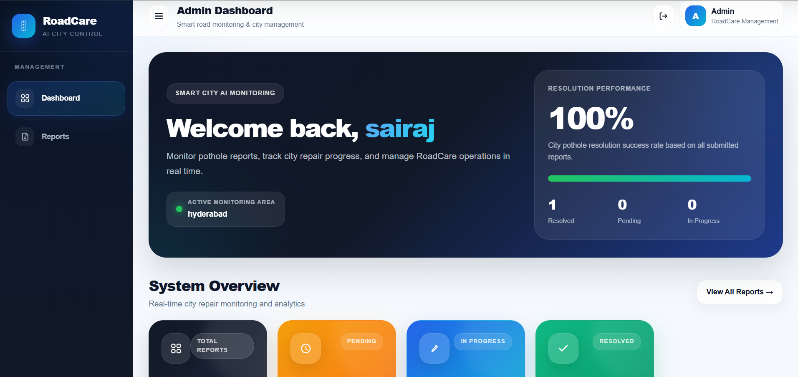
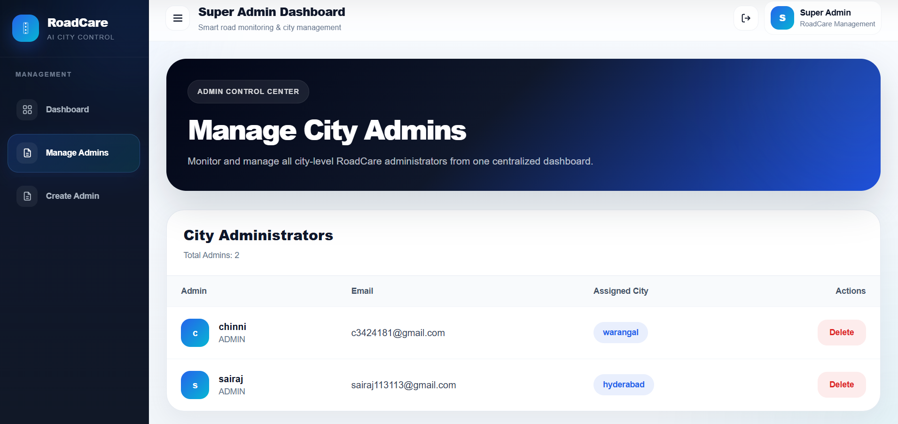
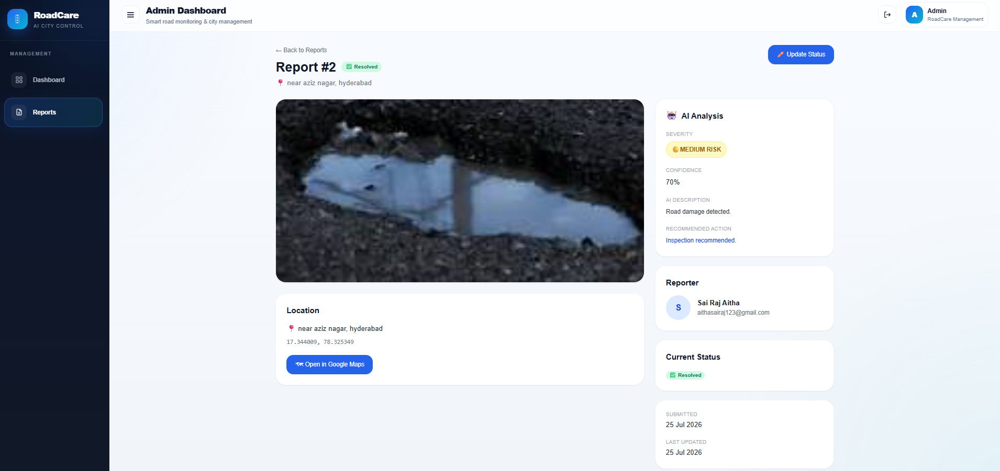
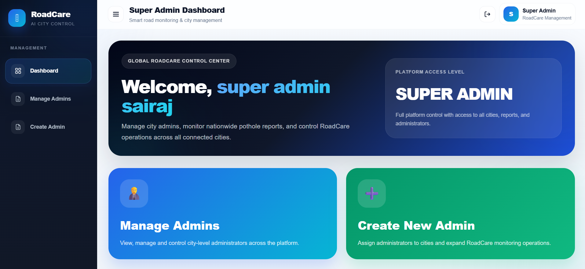

# RoadCare – Smart Pothole Reporting & Management System

RoadCare is a full-stack web application designed to make pothole reporting and road maintenance management easier.

Citizens can report potholes with location and image details, track their submitted reports, and view nearby road issues. Administrators can manage pothole reports for their assigned city, while the Super Admin manages city administrators and oversees the platform.

## Screenshots

### Home Page

The RoadCare home page provides users with quick access to pothole reporting, nearby road issues, reports, and other platform features.



---

### User Registration

New users can create a RoadCare account using the registration system and verify their email before accessing the platform.



---

### Report a Pothole

Users can report road damage by providing pothole details, uploading an image, and selecting the location of the pothole.



---

### My Reports

Users can view all pothole reports submitted from their account and track the current repair status.



---

### Nearby Potholes

The Nearby section allows users to discover reported potholes around their current location.



---

### User Profile

Users can view and manage their RoadCare profile and account information.



---

## Admin Dashboard

City administrators have a dedicated dashboard for monitoring and managing pothole reports within their assigned city.

### Admin Overview

The Admin Dashboard provides an overview of total, pending, in-progress, and resolved pothole reports.



---

### Manage Reports

Administrators can view pothole reports submitted by users within their assigned city and monitor their current repair status.



---

### Report Management

Administrators can inspect individual pothole reports, view report details, and update the repair status.

The report lifecycle is:

**Pending → In Progress → Resolved**



---

## Super Admin Dashboard

RoadCare includes a separate Super Admin system with platform-level administrative access.



The Super Admin can:

- Create new city administrators
- Assign administrators to specific cities
- View and manage existing administrators
- Control administrative access
- Monitor RoadCare administration across multiple cities

---

## Application Workflow

The overall RoadCare workflow is:

**User Registration → Email Verification → Login → Report Pothole → Admin Review → Status Update → User Tracks Report**

Administrative management follows:

**Super Admin → Creates City Admin → Assigns City → Admin Manages City Reports → Updates Repair Status**

This role-based structure separates citizen reporting, city-level report management, and platform-level administration.

---

## Features

### User
- User registration and login
- Email OTP verification
- Google authentication
- Report potholes
- Upload pothole images
- Add location details
- View submitted reports
- Track report status
- View nearby potholes
- Manage user profile
- Receive notifications

### Admin
- Separate Admin Dashboard
- City-based administration
- View pothole reports from the assigned city
- Monitor pending, in-progress, and resolved reports
- Update pothole report status
- View report details and images
- Track city-level repair progress

### Super Admin
- Separate Super Admin Dashboard
- Create city administrators
- Assign admins to cities
- View and manage administrators
- Control administrative access
- Oversee RoadCare operations across multiple cities

---

## User Flow

```text
Register
   ↓
Email OTP Verification
   ↓
Login
   ↓
RoadCare Home
   ↓
Report Pothole
   ↓
Add Image + Location + Details
   ↓
Submit Report
   ↓
Report Stored in Database
   ↓
Assigned City Admin Views Report
   ↓
Pending → In Progress → Resolved
   ↓
User Can Track Updated Status
```

---

## Admin Flow

```text
Super Admin
     ↓
Creates Admin
     ↓
Assigns City
     ↓
Admin Login
     ↓
Admin Dashboard
     ↓
Views Reports for Assigned City
     ↓
Updates Report Status
     ↓
Changes Reflected for Users
```

---

## Technology Stack

### Frontend
- React.js
- Vite
- JavaScript
- HTML5
- CSS3
- Axios
- React Router

### Backend
- Java
- Spring Boot
- Spring Security
- Spring Data JPA
- REST APIs
- JWT Authentication
- Maven

### Database
- MySQL
- Aiven Cloud MySQL

### Other Services
- Email OTP verification
- Google Authentication
- Image upload/storage integration
- Location-based pothole reporting

### Deployment
- Vercel – Frontend
- Render – Spring Boot Backend
- Aiven – Cloud MySQL Database

---

## System Architecture

```text
                USER
                  │
                  ▼
        React + Vite Frontend
             (Vercel)
                  │
             REST APIs
                  │
                  ▼
       Spring Boot Backend
             (Render)
                  │
                  ▼
          Aiven MySQL
            Database
```

The frontend communicates with the Spring Boot backend through REST APIs. The backend handles authentication, application logic, authorization, and database operations.

The MySQL database is hosted separately on Aiven, so application data is independent of the local MySQL database on the developer's computer.

---

## Role-Based Access Control

RoadCare contains three primary roles:

| Role | Access |
|---|---|
| USER | Report potholes and track reports |
| ADMIN | Manage pothole reports for an assigned city |
| SUPER_ADMIN | Manage admins and platform-level administration |

Spring Security and JWT authentication are used to protect APIs and restrict functionality based on the authenticated user's role.

---

## Pothole Report Lifecycle

Each pothole report moves through different stages:

```text
PENDING
   ↓
IN PROGRESS
   ↓
RESOLVED
```

This allows users to track what is happening with their reported road issue while administrators can manage repair progress.

---

## Cloud Database

RoadCare uses a cloud-hosted MySQL database on Aiven.

The same cloud database can be accessed using MySQL Workbench for database administration.

```text
MySQL Workbench
       │
       ▼
 Aiven Cloud MySQL
       ▲
       │
Spring Boot Backend
       ▲
       │
  RoadCare Website
```

MySQL Workbench is therefore used as a database management tool, while the actual project data is stored in the Aiven cloud database.

---

## Deployment Architecture

```text
GitHub Repository
       │
       ├───────────────┐
       ▼               ▼
    Vercel           Render
   Frontend          Backend
       │               │
       └──── API ──────┘
                       │
                       ▼
                 Aiven MySQL
```

The frontend and backend are deployed separately.

The Vercel frontend sends API requests to the deployed Spring Boot backend on Render. The backend processes those requests and reads or writes the required information in the Aiven MySQL database.

---

## Security

RoadCare implements:

- JWT-based authentication
- Password hashing
- Spring Security
- Role-based authorization
- Protected backend APIs
- Email OTP verification
- Google authentication
- Separate User, Admin, and Super Admin access

Sensitive credentials and database passwords should be configured using environment variables and should never be committed directly to the GitHub repository.

---

## Project Structure

```text
RoadCare/
│
├── backend/
│   ├── src/
│   ├── pom.xml
│   └── ...
│
├── frontend/
│   ├── src/
│   ├── images/
│   ├── package.json
│   └── ...
│
└── README.md
```

---

## Main Objective

The main objective of RoadCare is to provide a centralized digital platform connecting citizens and road-management administrators.

Instead of only reporting a road problem, users can follow its progress while administrators receive a structured system for managing pothole reports based on location and status.

---

## Future Enhancements

Possible future improvements include:

- AI-based pothole severity detection
- Automatic duplicate pothole detection
- Advanced analytics dashboard
- Repair priority prediction
- Mobile application
- Improved map visualization
- Government/municipality integration
- Automated admin notifications

---

## Project Status

**Completed – Full Stack Web Application**

The application includes user authentication, pothole reporting, report tracking, city-based admin management, Super Admin functionality, cloud database integration, and production deployment.

---

## Author

**Sai Raj Aitha**

B.Tech Computer Science Student  
Full Stack Developer

---

